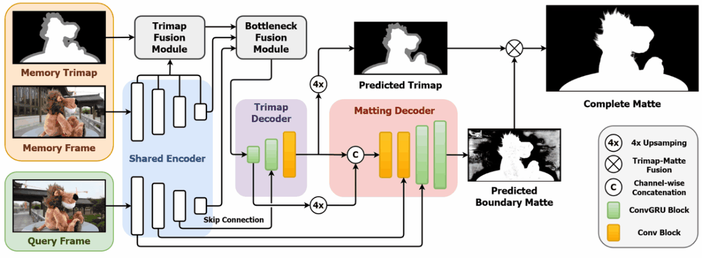

# FTP-VM (CVPR2023)
Implementation and videos of **End-to-End Video Matting With Trimap Propagation** in CVPR2023.

[[CVPR OpenAccess]](https://openaccess.thecvf.com/content/CVPR2023/html/Huang_End-to-End_Video_Matting_With_Trimap_Propagation_CVPR_2023_paper.html) 
[[Presentation Video]](https://youtu.be/3jjA4nvUc8c)
[Paper PDF] 
[Supplementary Video]



# To do
- Clean the training / data processing code
- Readme / Manual
- Reference github repo
- Upload more supplementary videos
- (Possibly) Collaborate with SegmentAnyThing


# Installation
Feel free to edit versions of packages for convinience.
```
pip install -r requirements.txt
```

# Model Usage
For those who want to use the model via code directly.
```python
import torch
from FTPVM.model import FastTrimapPropagationVideoMatting as FTPVM
model = FTPVM()
model.load_state_dict(torch.load('saves/ftpvm.pth'))
```
Usage
```python
# Images are in [0, 1] with size of (batch, time, channel, height, width)
# Memory has 1 frame per batch, and trimap (mask) has 1 channel.
query_imgs = torch.rand((2, 4, 3, 256, 256))
memory_imgs = torch.rand((2, 1, 3, 256, 256))
memory_trimaps = torch.rand((2, 1, 1, 256, 256))
# General forward
trimaps, boundary_mattes, full_mattes, recurrent_mems = model(query_imgs, memory_imgs, memory_trimaps)
# Forward with RNN memory
trimaps, boundary_mattes, full_mattes, recurrent_mems = model(query_imgs, memory_imgs, memory_trimaps, *recurrent_mems)
# Preserve memory key & values in Memory matching, which is useful in application
memory_key_val = model.encode_imgs_to_value(memory_imgs, memory_trimaps)
trimaps, boundary_mattes, full_mattes, recurrent_mems = model.forward_with_memory(query_imgs, *memory_key_val, *recurrent_mems)
```

# Inference (TBD)

## Dataset
## Webcam
still not robust enough to webcam frames :(
## Raw video


# Training (TBD)
## Dataset
Please put them in `dataset` folder at the same level (or symbolic link) as `FTP-VM` folder (this repo).
```
- dataset
  - Distinctions646
    - Train
  - VideoMatting108
    - BG_done
    - FG_done
    - ...
  - BG20k
    - BG-20k
  - YoutubeVIS
    - train

- FTP-VM (Model folder)
  - train.py
  - ...
```

- Image Matting Dataset: [D646](https://github.com/yuhaoliu7456/CVPR2020-HAttMatting)
- Video Matting Dataset: [VM108](https://github.com/yunkezhang/TCVOM#videomatting108-dataset)
- Video Object Segmentation Dataset: [YoutubeVIS 2019](https://youtube-vos.org/dataset/vis/)
- Background Image Dataset: [BG-20k](https://github.com/JizhiziLi/GFM)

If you just want to train on VM108 dataset, please read [VM108 dataset only](###VM108-dataset-only).

## Run

### Main setting
```shell
python train.py \
--id FTPVM \
--which_model FTPVM \
--num_worker 12 \
--benchmark \
--lr 0.0001 -i 120000 \
--iter_switch_dataset 30000 \
--use_background_dataset \
-b_seg 8 -b_img_mat 10 -b_vid_mat 4 \
-s_seg 8 -s_img_mat 4 -s_vid_mat 8 \
--seg_cd 20000 --seg_iter 10000 --seg_start 0 --seg_stop 100000 \
--size 480 \
--tvloss_type temp_seg_allclass_weight
```

### VM108 dataset only
```shell
python train.py \
--id FTPVM_VM108_only \
--which_model FTPVM \
--num_worker 12 \
--benchmark \
--lr 0.0001 -i 120000 \
--iter_switch_dataset 0 \
-b_vid_mat 4 -s_vid_mat 8 --seg_stop -1 \
--size 480 \
--tvloss_type temp_seg_allclass_weight
```


<details>
  <summary>Simple explanation</summary>

- `--id` : experiment name
- `--which_model` : defined model name in `model/which_model.py`
- `--use_background_dataset` : composite the data with an additional BG20k dataset as well
- `--iter_switch_dataset 30000` : switch to video dataset at N iter
- `-b_seg 8 -b_img_mat 10 -b_vid_mat 4` : batch size of datasets
- `-s_seg 8 -s_img_mat 4 -s_vid_mat 8` : sequence / clip length of datasets
- `--seg_cd 20000 --seg_iter 10000 --seg_start 0 --seg_stop 100000` : \
segmentation training starts at 0th iter, runs for 10000 iters followed by 20000-iters cooldown, stop at 100000th iter.
- `--tvloss_type` : variant of segmentation inconsistency loss
</details>


# Citation
```bibtex
@InProceedings{Huang_2023_CVPR,
    author    = {Huang, Wei-Lun and Lee, Ming-Sui},
    title     = {End-to-End Video Matting With Trimap Propagation},
    booktitle = {Proceedings of the IEEE/CVF Conference on Computer Vision and Pattern Recognition (CVPR)},
    month     = {June},
    year      = {2023},
    pages     = {14337-14347}
}
```
## Useful Repositories
(TBD)
RVM
MiVOS
STCN
